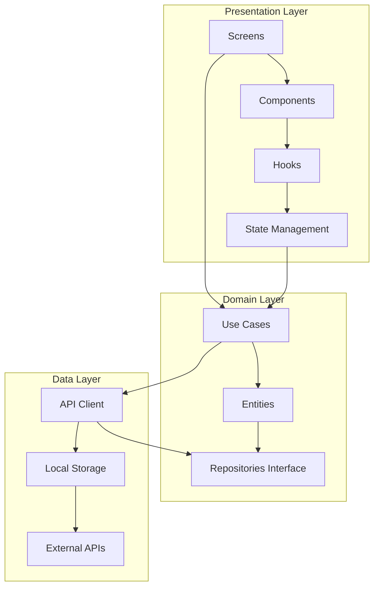
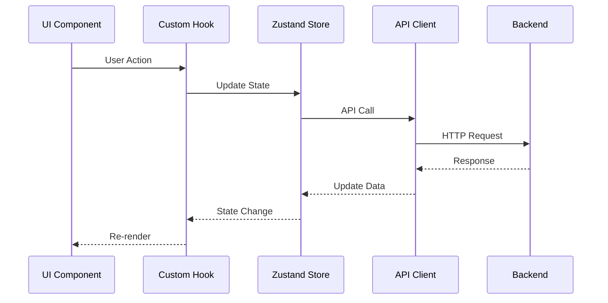
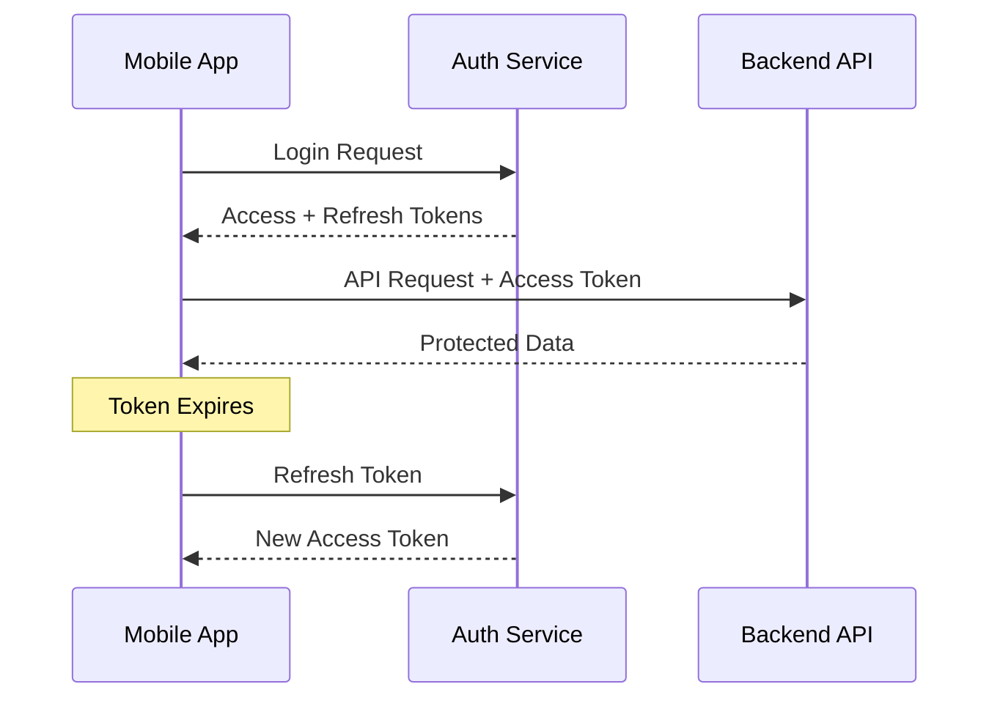
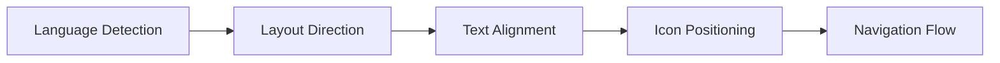

# 🏗️ Aura Browser Architecture

## Overview

Aura Browser follows **Clean Architecture** principles with clear separation of concerns across three main layers:



## Layer Responsibilities

### 🎨 Presentation Layer
- **Screens**: Route-level components using expo-router
- **Components**: Reusable UI components with NativeWind
- **Hooks**: Custom hooks for component logic
- **State**: Zustand stores for global state

### 🧠 Domain Layer
- **Use Cases**: Business logic and application rules
- **Entities**: Core business objects and types
- **Repository Interfaces**: Contracts for data access

### 💾 Data Layer
- **API Client**: HTTP client with interceptors
- **Local Storage**: MMKV for fast local storage
- **External APIs**: Third-party service integrations

## Feature Architecture

Each feature follows the **Feature Slice** pattern:

```
src/features/browser/
├── components/          # Feature-specific components
├── hooks/              # Feature-specific hooks
├── services/           # Business logic
├── types/              # Feature types
└── index.ts            # Public API
```

## State Management Strategy

### Global State (Zustand)
- Browser settings
- Active tabs
- User preferences
- Authentication state

### Local State (React hooks)
- Component-specific UI state
- Form state (react-hook-form)
- Temporary data

### Server State (TanStack Query)
- API data caching
- Background synchronization
- Optimistic updates

## Data Flow



## Security Architecture

### Data Protection
- **Sensitive Data**: Stored in expo-secure-store
- **Regular Data**: Stored in MMKV with encryption
- **API Communication**: HTTPS only with certificate pinning

### Authentication Flow


## Performance Considerations

### Optimization Strategies
- **Bundle Splitting**: Feature-based code splitting
- **Image Optimization**: WebP format with fallbacks
- **List Virtualization**: For large datasets
- **Memory Management**: Proper cleanup of subscriptions

### Monitoring
- **Performance Metrics**: FPS, memory usage, bundle size
- **Error Tracking**: Crash reporting and error boundaries
- **Analytics**: User behavior and feature usage

## Testing Strategy

### Test Pyramid
```
    E2E Tests (Detox)
         /\
        /  \
   Integration Tests
      /        \
     /          \
Unit Tests (Jest + RTL)
```

### Coverage Targets
- **Unit Tests**: 80%+ coverage
- **Integration Tests**: Critical user flows
- **E2E Tests**: Main user journeys

## Deployment Architecture

### Mobile Deployment
- **EAS Build**: Automated builds for Android/iOS
- **OTA Updates**: Expo Updates for quick fixes
- **App Store**: Google Play Store + Apple App Store

### Backend Deployment
- **Containerization**: Docker + Docker Compose
- **Cloud Hosting**: AWS/GCP/Azure
- **Database**: Managed PostgreSQL
- **CDN**: Static assets delivery

## Scalability Considerations

### Horizontal Scaling
- **Microservices**: Feature-based service separation
- **Load Balancing**: Multiple backend instances
- **Database Sharding**: User-based data partitioning

### Vertical Scaling
- **Caching**: Redis for session and data caching
- **Database Optimization**: Indexing and query optimization
- **CDN**: Global content delivery

## Internationalization (i18n)

### Language Support
- **Arabic**: RTL layout with proper text rendering
- **English**: LTR layout (default)
- **Extensible**: Easy addition of new languages

### RTL Implementation


## Decision Records (ADRs)

### ADR-001: State Management Choice
**Decision**: Use Zustand over Redux Toolkit
**Rationale**: 
- Smaller bundle size
- Better TypeScript integration
- Simpler API
- Built-in persistence

### ADR-002: Styling System Choice
**Decision**: Use NativeWind over styled-components
**Rationale**:
- Consistent with web development
- Better performance
- Smaller runtime overhead
- Excellent TypeScript support

### ADR-003: Navigation Choice
**Decision**: Use expo-router over React Navigation
**Rationale**:
- File-based routing
- Better TypeScript integration
- Automatic deep linking
- Future-proof with Expo ecosystem

## Security Considerations

### Data Security
- **Encryption**: All sensitive data encrypted at rest
- **Secure Communication**: TLS 1.3 for all API calls
- **Input Validation**: Zod schemas for all inputs
- **XSS Protection**: Content Security Policy for WebView

### Privacy Features
- **Incognito Mode**: No data persistence
- **Ad Blocking**: Built-in ad and tracker blocking
- **Do Not Track**: Automatic DNT headers
- **Secure DNS**: DNS over HTTPS support

## Performance Benchmarks

### Target Metrics
- **App Launch**: < 2 seconds cold start
- **Navigation**: < 100ms between screens
- **WebView Loading**: < 3 seconds for average page
- **Memory Usage**: < 150MB average
- **Battery Impact**: Minimal background usage

### Monitoring Tools
- **Flipper**: Development debugging
- **React DevTools**: Component inspection
- **Performance Monitor**: FPS and memory tracking